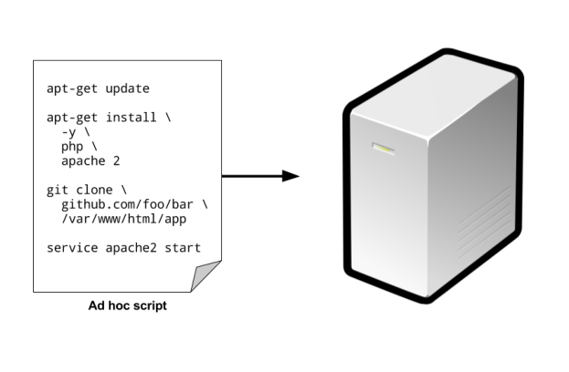

% Infrastructure as Code
% Ion Mudreac
% TEDA 17 May 2017

---

#### About me


* SCB CDO DevOps Transformation Lead,
* Economist by training
* AWS Certified

---

#### Content


* The rise of DevOps
* What is infrastructure as code
* Benefits of infrastructure as code
* Compares infrastructure as code tools

---

#### The rise of DevOps


* Agile 2008 Conference in Toronto
    * Andrew Clay Shafer and Patrick Debois
    * Google group called “Agile System Administration”
* October 30-31 2009: DevOpsDays (Ghent)
    * Conversation continued on Twitter and the #DevOps hashtag was born

---

#### The rise of DevOps


* Loose Taxonomies
    * Culture ( Improvement )
    * Automation ( Delivery )
    * Measurement ( Learning )
    * Sharing ( Collaboration )
* Continuous

---

#### The rise of DevOps


- DevOps is NOT a department or a framework or a methodology or a tool
- DevOps does spring from the Agile way of doing things
- DevOps is not Agile

---

#### What is infrastructure as code


* Infrastructure as code (IAC) is that you write and execute code to:
    * define,
    * deploy,
    * update infrastructure
* Key insight of DevOps is that you can manage almost everything in code

---

#### What is infrastructure as code


* There are four broad categories of IAC tools:
    * Ad hoc scripts
    * Configuration management tools
    * Server templating tools
    * Orchestration tools

---

#### Ad hoc scripts




---

#### Ad hoc scripts


* Ex Bash script called setup-webserver.sh

```
#!/bin sh

# Update the apt-get cache
sudo apt-get update

# Install PHP
sudo apt-get install -y php

# Install Apache
sudo apt-get install -y apache2

# Copy the code from repository
sudo git clone https://github.com/test/php-app.git /var/www/html/app

# Start Apache
sudo service apache2 start
```

---

#### Configuration management tools


* Chef, Puppet, Ansible, and SaltStack are all configuration management tools

```
- name: Update the apt-get cache
  apt:
    update_cache: yes

- name: Install PHP
  apt:
    name: php

- name: Install Apache
  apt:
    name: apache2

- name: Copy the code from repository
  git: repo=https://github.com/test/php-app.git dest=/var/www/html/app

- name: Start Apache
  service: name=apache2 state=started enabled=yes
```

---

#### Configuration management tools


---

#### Server templating tools


* Docker, Packer, and Vagrant
```
{
    "builders": [{
        "ami_name": "packer-example",
        "instance_type": "t2.micro",
        "region": "us-east-1",
        "type": "amazon-ebs",
        "source_ami": "ami-40d28157",
        "ssh_username": "ubuntu"
    }],
    "provisioners": [{
        "type": "shell",
        "inline": [
            "sudo apt-get update",
            "sudo apt-get install -y php",
            "sudo apt-get install -y apache2",
            "sudo git clone https://github.com/test/php-app.git /var/www/html/app"
        ]
    }]
}
```

---

#### Server templating tools


---

#### Server templating tools


* **Virtual machine (VM)** _emulates an entire computer system_
    * VMWare,
    * VirtualBox,
    * Parallels
* **Containers** _emulates the user space of an operating system_
    * Docker
    * CoreOS ( rkt )

---

#### Orchestration tools


* Terraform, CloudFormation OpenStack Heat

```
resource "aws_instance" "app" {
    instance_type = "t2.micro"
    availability_zone = "us-east-1a"
    ami = "ami-40d28157"
    user_data = <<-EOF
        #!/bin/bash
        sudo service apache2 start
        EOF
}
resource "aws_db_instance" "db" {
    allocated_storage = 10
    engine = "mysql"
    instance_class = "db.t2.micro"
    name = "mydb"
    username = "admin"
    password = "password"
}
resource "aws_elb" "load_balancer" {
    name = "frontend-load-balancer"
    instances = ["${aws_instance.app.id}"]
    availability_zones = ["us-east-1a"]
    listener {
        instance_port = 8000
        instance_protocol = "http"
        lb_port = 80
        lb_protocol = "http"
    }
}
```

---

#### Orchestration tools


---

#### Benefits of infrastructure as code


* Self-service
* Speed and safety
* Documentation
* Version control
* Validation
* Reuse

---

#### Comparison between (IAC) tools


* Configuration management vs orchestration
* Mutable infrastructure vs immutable infrastructure
* Procedural language vs declarative language
* Client/server architecture vs client-only architecture
* Large community vs small community
* Mature vs cutting-edge

---

#### Configuration management vs orchestration


* configuration management tools
    * Chef, Puppet, Ansible, SaltStack
* orchestration tools
    * CloudFormation, Terraform, OpenStack Heat
* server templating tools
    * Docker, Packer, Vigrant

---

#### Mutable infrastructure vs immutable infrastructure


* mutable infrastructure paradigm
    * Chef, Puppet, Ansible, SaltStack

* immutable infrastructure paradigm
    * CloudFormation, Terraform, OpenStack Heat, Docker, Packer, Vigrant


---

#### Procedural language vs declarative language


* procedural style (write code that specifies, step-by-step, how to to achieve some desired end state)
    * Chef, Ansible
* declarative style (write code that specifies your desired end state)
    * Terraform, CloudFormation, SaltStack, Puppet, Open Stack Heat

---

#### Procedural language vs declarative language Ex.


* Ansible

```
- ec2:
    count: 10
    image: ami-40d28157
    instance_type: t2.micro
```
* Terraform

```
resource "aws_instance" "example" {
    count = 10
    ami = "ami-40d28157"
    instance_type = "t2.micro"
}
```

---

#### Procedural language vs declarative language Ex.


* Ansible

```
- ec2:
    count: 5
    image: ami-40d28157
    instance_type: t2.micro
```
* Terraform

```
resource "aws_instance" "example" {
    count = 15
    ami = "ami-40d28157"
    instance_type = "t2.micro"
}
```

---

#### Procedural language vs declarative language


* Procedural code does NOT fully capture the state of the infrastructure.
    * With procedural codebase, you have to know the full history of every change that has ever happened.
* Procedural code limits reusability
    * The reusability of procedural code is inherently limited because you have to manually take into account the current state of the codebase.


---

### Client/server architecture vs client-only architecture


* client/server architecture
    * Chef, Puppet, SaltStack, CloudFormation, and Heat
* client-only architecture
    * Ansible, and Terraform

---

### A comparison of IAC tools


---

#### An Introduction to Terraform


* Original author Mitchell Hashimoto
* 1st Time released in July 28, 2014
* Latest release 0.9.5 in May 11, 2017
* Operating system supported;
	* Linux, FreeBSD, macOS, OpenBSD, Solaris, and Microsoft Windows
* Website [www.terraform.io](www.terraform.io)

---

#### How Terraform works


* written in the Go programming language
* one single binary
* terraform binary make API calls to one or more providers:
    * Amazon Web Services (AWS)
    * Azure
    * Google Cloud
    * DigitalOcean
    * etc.
* terraform templates

---

#### How Terraform works


---

#### An Introduction to Docker Image


* image
    * An image is a lightweight, stand-alone, executable package that includes everything needed to run a piece of software, including the code, a runtime, libraries, environment variables, and config files.

---

#### An Introduction to Docker Container


* container
    * A container is a runtime instance of an image – what the image becomes in memory when actually executed. It runs completely isolated from the host environment by default, only accessing host files and ports if configured to do so.

---

#### Dockerfile


```
# Use an official Python runtime as a base image
FROM python:2.7-slim

# Set the working directory to /app
WORKDIR /app

# Copy the current directory contents into the container at /app
ADD . /app

# Install any needed packages specified in requirements.txt
RUN pip install -r requirements.txt

# Make port 80 available to the world outside this container
EXPOSE 80

# Define environment variable
ENV NAME World

# Run app.py when the container launches
CMD ["python", "app.py"]
```


---

### Docker vs VM


---

### Docker vs VM


---

# Demo & Questions ?

---